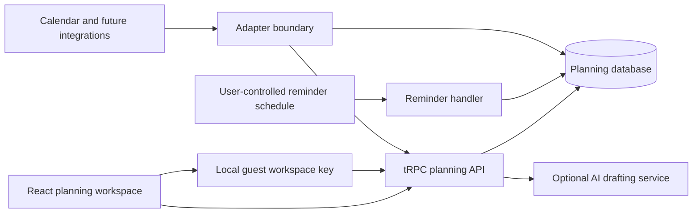

# Architecture and Reliability Contract

## Boundary and ownership model

Personal Calander is implemented as a browser-scoped planning workspace backed by a full-stack application. A cryptographically random `workspaceId` is generated once in the browser and stored locally. Every API request carries it, and every persisted planning record is constrained by it. This gives a person a separate, opaque guest workspace without requiring sign-in.

This is deliberately an **anonymous isolation boundary**, not account-grade identity. Clearing browser storage loses the capability to access that guest workspace, and an authenticated release will replace the browser capability with a server-verified user/workspace membership check. The schema keeps the workspace foreign key on every personal record so this upgrade changes access control rather than the data model.

## System composition

The planning database is the source of truth. Integrations are adapters that add read-only external events or create explicitly confirmed planning records. They never replace local goals, tasks, habits, or review data. AI returns a schema-validated draft and cannot write records without a confirmation mutation.

## Domain invariants

| Concern | Rule | Failure behavior |
| --- | --- | --- |
| Workspace scope | Every row has a `workspaceId`; all reads and writes require it | Missing or mismatched IDs return `NOT_FOUND`, not cross-workspace data |
| Optimistic concurrency | Every mutable planning row carries a version | An update with a stale version returns a typed conflict response including the current row |
| Lifecycle | Active records transition among `not_started`, `in_progress`, `blocked`, and `completed`; archive is reversible | Invalid transitions are rejected with an explainable validation error |
| Dependencies | Hard dependencies block completion; soft dependencies warn only | Self-dependency and cycles are rejected before write |
| Dates | Instants are UTC; date-only commitments are `YYYY-MM-DD` interpreted in workspace timezone | Rendering always transforms from the stored contract, preventing browser-timezone drift |
| Recurrence | Task master, recurrence rule, and completed/skipped instances are separate | Editing the master never rewrites historical occurrences |
| Habit integrity | Each habit has at most one check-in per local date | Retries upsert the same date instead of creating duplicates |
| Analytics | Dashboard calculations use stored facts and a requested local-date range | Empty windows return zero-valued summaries and explanatory empty states |
| Reminder delivery | Schedules are opt-in and idempotent | Snooze does not change the task date; a duplicate callback does not duplicate a reminder |
| External sync | Provider cursors and provider records stay outside core task entities | Cursor expiry triggers full replacement of only imported provider records |

## Temporal model

A due date means an outcome should be complete by the end of a date. A scheduled date means the person intends to work on it that day. A timeblock is an optional UTC start/end instant that reserves a place in the calendar. These are distinct fields because collapsing them creates ambiguous rescheduling behavior.

Local-date rules run in the workspace timezone. If a person changes timezone, historical check-ins retain their original `localDate` and `timezoneAtCheckIn`; future recurrence and daily planning use the new workspace timezone. Moving a timed block through the calendar preserves duration by default. A move that crosses the local day boundary updates the local scheduled date and the UTC instants together.

## Recurrence state machine

The recurrence master remains active while generated occurrences represent a single planned date. Each occurrence can be `pending`, `completed`, `skipped`, `rescheduled`, or `missed`. A pending occurrence becomes missed only after the relevant local-day cut-off; it never becomes completed implicitly. Completion-anchored rules calculate the next occurrence from completion, while schedule-anchored rules retain their original cadence. Updating a rule is forward-only by default; a person must choose an explicit destructive option to regenerate future pending occurrences.

## API shape

The application exposes focused procedures for workspace settings, categories, goals, projects, tasks, task dependencies, habits, check-ins, saved views, dashboard summaries, reviews, reminders, AI drafts, and integration metadata. Mutations accept the workspace key, validated data, and `expectedVersion` where applicable. Queries accept stable date-range primitives rather than freshly constructed client objects, preventing unintended repeated requests.

## Reminder and integration activation

Reminder configuration can be saved immediately, but delivery jobs are disabled until the deployed application is live. The scheduling callback identifies the reminder using the platform-owned schedule task identifier rather than client-submitted payload fields. It is authenticated, idempotent, and returns structured errors for investigation.

Calendar adapters use initial sync, persisted cursors, incremental reconciliation, deletion handling, and full resync after cursor expiration. Webhook notifications are treated as hints to synchronize rather than as the sole event payload. This supports eventual consistency, retries, and duplicated notifications safely.
