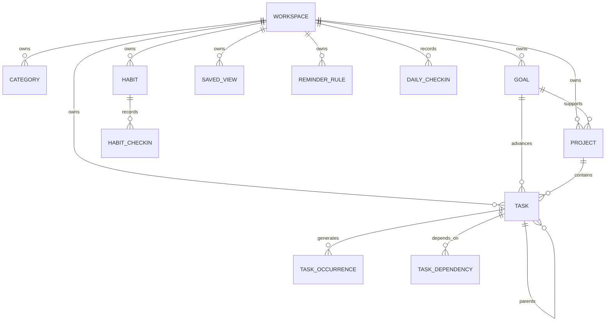

# Data Model

## Ownership and isolation

The release starts without authentication. Each persisted record is still associated with a stable `workspaceId`, seeded once per browser and carried by the client. This prevents an anonymous-mode schema from becoming structurally incompatible with future per-user isolation. A later authenticated profile can claim or replace the workspace identifier without rewriting the planning entities.

## Primary entities

| Entity | Responsibility | Key relationships |
| --- | --- | --- |
| Workspace | Timezone, start-of-week, review preferences, display preferences, and data boundary | Owns all records |
| Category | Named color-coded context such as Health or Deep Work | Used by goals, projects, tasks, and habits |
| Goal | Desired outcome with a horizon and measurable target | Contains projects and contributes progress signals |
| Project | Finite outcome-oriented body of work | Belongs to an optional goal and contains tasks |
| Task | Actionable work item | Optional project/goal, optional parent task, optional schedule, many dependencies |
| TaskOccurrence | Immutable execution instance of a recurring task | References recurring task and captures date-specific status |
| Habit | Repeated practice tracked against a frequency rule | Owns habit check-ins and streak calculations |
| HabitCheckIn | Explicit completion, skip, or miss fact for a local date | Belongs to a habit |
| DailyCheckIn | A daily intention and reflection record | Belongs to a workspace date |
| SavedView | User-defined filter, sort, and grouping configuration | Belongs to a workspace |
| ReminderRule | Opt-in reminder timing and delivery state | Targets a task, goal, review, or daily plan |
| IntegrationConnection | Configuration metadata and state for an external adapter | Isolated from core planning entities |

## Versioning and temporal rules

Mutable entities have `updatedAt` and a monotonic `version`. Updates require the current version. A stale write returns a conflict payload that lets the interface refresh or resolve intentionally. Business timestamps are UTC instants; date-only planning values are stored as a canonical local-date string alongside the relevant workspace timezone context.

## Relationship diagram

## Query-oriented indexes

Records are indexed by workspace and the fields used in routine planning queries: task state, due date, scheduled date, parent, project, goal, and updated time; habit check-ins by habit and local date; saved views and reminders by workspace; and external events by provider connection and external identifier. Composite uniqueness prevents duplicate daily check-ins, habit check-ins, dependency links, and provider event imports.
